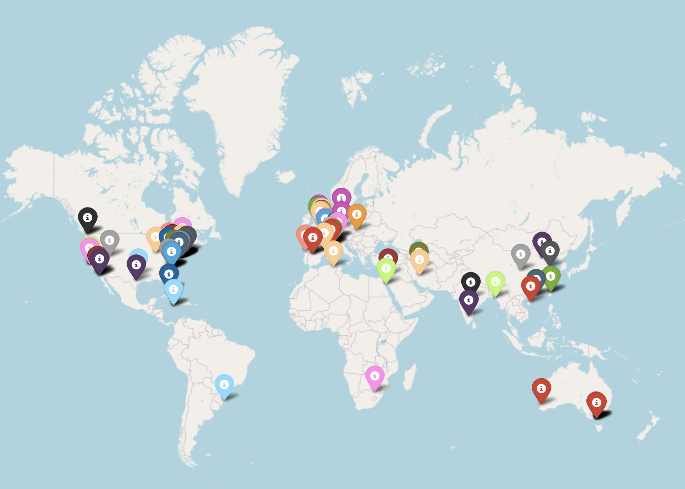

# Google Scholar Citation World Map

Chen Liu, CS PhD Candidate at Yale University

## Purpose
This is a simple Python tool to generate a HTML citation world map from your Google Scholar ID.

## Warning
1. This script is a bit slow. On my personal computer, it takes half a minute to process each citation. If you have thousands of citations, it may or may not be a good idea to use this script.
2. I tried to use multiprocessing, but unfortunately the excessive visits get me blocked by Google Scholar.

## Demo


## Usage
1. Install the package.
```
pip install citation-map
```

2. Find your Google Scholar ID.

    On your Google Scholar profile, the string `GOOGLE_SCHOLAR_ID` in the URL `https://scholar.google.com/citations?user=GOOGLE_SCHOLAR_ID` be will be your Google Scholar ID. Ignore the configuration strings such as `&hl=en` or `&view_op=list_works&sortby=pubdate`.

3. In an empty Python script, run the following.
```
from citation_map import citation_map_from_google_scholar_id

# This is my Google Scholar ID. Replace this with your ID.
scholar_id = "3rDjnykAAAAJ"
citation_map_from_google_scholar_id(scholar_id)
```

## Dependencies
```
scholarly
geopy
folium
tqdm
```

## Acknowledgements
This script was written under the help of ChatGPT-4o, but of course after intense debugging.
