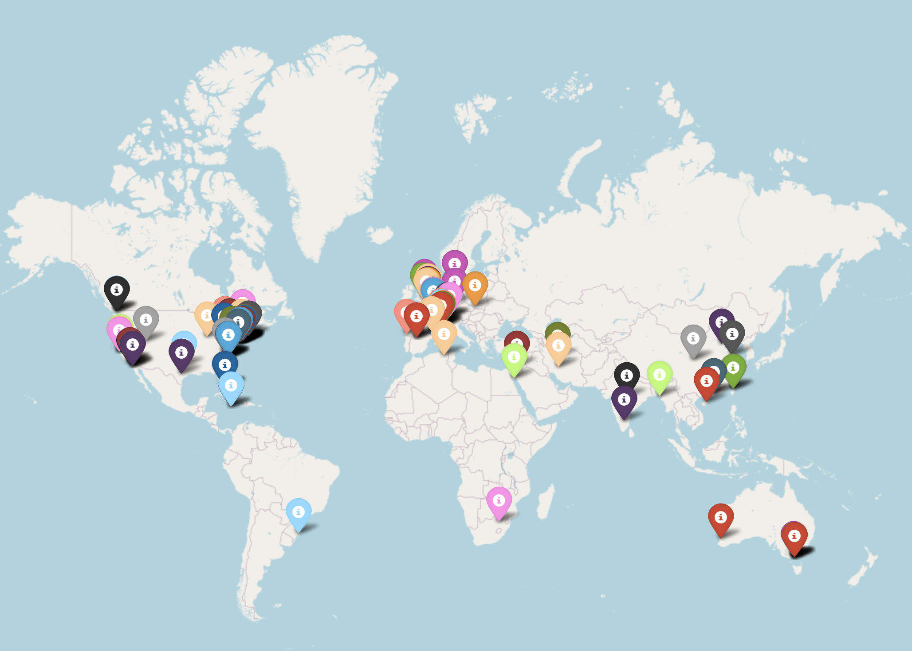

<h1 align="center">
&#127759; <code>CitationMap</code>: 谷歌学术引用世界地图
</h1>

<p align="center">
<strong>CitationMap：用 Python 识别并可视化你的谷歌学术引用分布</strong> [<a href="https://openreview.net/pdf?id=BqJgCgl1IA">PDF</a>]
</p>

<p align="center"><a href="README.md">English</a> | 中文</p>

<div align="center">

[](https://openreview.net/pdf?id=BqJgCgl1IA)
[](https://www.techrxiv.org/users/809001/articles/1213717-citationmap-a-python-tool-to-identify-and-visualize-your-google-scholar-citations-around-the-world)
[](https://twitter.com/ChenLiu_1996)
[](https://www.linkedin.com/in/chenliu1996/)
[](https://scholar.google.com/citations?user=3rDjnykAAAAJ&sortby=pubdate)
<br>
[](https://pypi.org/project/citation-map/)
[](https://pepy.tech/projects/citation-map)
[](https://pypistats.org/packages/citation-map)
[![CC BY-NC-SA 4.0][cc-by-nc-sa-shield]][cc-by-nc-sa]
[![CC BY-NC-SA 4.0][cc-by-nc-sa-image]][cc-by-nc-sa]

[cc-by-nc-sa]: http://creativecommons.org/licenses/by-nc-sa/4.0/
[cc-by-nc-sa-image]: https://licensebuttons.net/l/by-nc-sa/4.0/88x31.png
[cc-by-nc-sa-shield]: https://img.shields.io/badge/License-CC%20BY-NC-SA%204.0-lightgrey.svg

</div>

&#127942; **全球首个免费工具**，将你的谷歌学术引用可视化到世界地图上。

&#11088; **无需 clone 或 fork** 本仓库即可使用，除非你要自定义修改。

&#128640; **一行安装，四行运行**！

&#127760; 需安装 Chrome 浏览器，验证码会通过 Chrome 弹窗完成。

&#128073; 因个人原因，无法再为遇到问题的用户代为运行 CitationMap，敬请谅解。

<br>

我是 [Chen Liu](https://chenliu-1996.github.io/)，耶鲁大学计算机科学博士生。

## 用途

本工具根据你的 [Google Scholar ID](https://scholar.google.com/citations?user=3rDjnykAAAAJ) 生成 HTML 格式的引用世界地图。

安装简单（已上架 [PyPI](https://pypi.org/project/citation-map/)），使用简单（见下方[简明指南](#简明使用指南)或[完整指南](#使用指南)）。

## 简明使用指南

面向熟悉 Python 的用户。若不熟悉，请阅读[使用指南](#使用指南)。

**简而言之：若只想使用，请不要 clone 或 fork！用 pip 安装后写几行脚本即可。** 否则只会增加不必要的复杂度。

### &#128640; 一行安装

```
pip install citation-map
```

若要安装最新版：`pip install citation-map --upgrade`。

### &#128640; 四行运行

将下面代码复制到一个空的 `.py` 文件（如 `run.py`），把 Scholar ID 换成你的，然后执行 `python run.py`。

```python3
from citation_map import generate_citation_map

if __name__ == '__main__':
    scholar_id = '3rDjnykAAAAJ'  # 这是我的 Google Scholar ID，请替换成你的。
    generate_citation_map(scholar_id)
```

## 预期输出

脚本会生成一个 **HTML 文件**。

在浏览器中打开即可看到你的引用世界地图，效果类似下图。



同时会生成一个 **CSV 文件**，记录引用信息（引用作者、引用文献、被引文献、机构、详细位置）。

**免责声明：** 本工具可能出现小误差：漏掉少量引用作者、个别标注位置不准等。若你非常在意引用作者机构完整且位置精确，可考虑在 [Google My Maps](https://www.google.com/maps/d/) 上手动标注。本工具面向不想手动处理、且引用量较多的用户。

**说明：** 可通过 `affiliation_conservative` 参数在**机构识别的精确率与召回率之间权衡**。设为 `True` 时，将只使用引用者在谷歌学术上验证过的官方机构名称，策略非常保守（需作者在个人页填写并验证邮箱，且机构被谷歌收录，例如 Meta 目前不在列表中）。感谢 [Zhijian Liu](https://github.com/zhijian-liu) 的[讨论](https://github.com/ChenLiu-1996/CitationMap/issues/8)。

## 引用

BibTeX
```
@article{citationmap,
  title={CitationMap: A Python Tool to Identify and Visualize Your Google Scholar Citations Around the World},
  author={Liu, Chen},
  journal={Authorea Preprints},
  year={2024},
  publisher={Authorea}
}
```
MLA
```
Liu, Chen. "CitationMap: A Python Tool to Identify and Visualize Your Google Scholar Citations Around the World." Authorea Preprints (2024).
```
APA
```
Liu, C. (2024). CitationMap: A Python Tool to Identify and Visualize Your Google Scholar Citations Around the World. Authorea Preprints.
```
Chicago
```
Liu, Chen. "CitationMap: A Python Tool to Identify and Visualize Your Google Scholar Citations Around the World." Authorea Preprints (2024).
```

## 动态

**[征求建议]**  
本人首次做爬虫/抓取相关开发，用户反馈存在稳定性问题，主要怀疑为：(1) 触发验证码或机器人检测；(2) 被谷歌学术限流/封禁。若你在这些方面有经验并有改进建议，欢迎提 **GitHub issue 或 pull request**。

[2025年10月14日] 5.0 发布 >>> 改进验证码处理。

[2024年8月2日] 4.0 发布 >>> 新增参数 `affiliation_conservative`，可选用更保守的机构识别策略（更高精确率、更低召回率）。感谢 [Zhijian Liu](https://github.com/zhijian-liu) 的[讨论](https://github.com/ChenLiu-1996/CitationMap/issues/8)。

[2024年7月28日] 3.10 发布 >>> 逻辑更新，已在**约 1 万引用**的教授页面上测试通过。

[2024年7月27日] 2.0 发布 >>> 多进程约 10 倍加速（本人 100 引用从约 1 小时降至约 5 分钟）。

[2024年7月26日] 1.0 发布 >>> 首个可运行版本（本人 100 引用）。

## 使用指南

0. 若你刚接触 Python，建议先使用带环境管理的发行版（如 [Anaconda](https://www.anaconda.com/)）。环境就绪后（例如能执行 `conda activate env39`，可参考[此教程](https://www.youtube.com/watch?v=MUZtVEDKXsk&t=242s)），进行下一步。
1. 在可调用 conda 的命令行中执行：
    ```
    pip install citation-map --upgrade
    ```
2. 找到你的 Google Scholar ID。
   - 打开你的谷歌学术个人页，URL 形如 `https://scholar.google.com/citations?user=GOOGLE_SCHOLAR_ID`，其中的 `GOOGLE_SCHOLAR_ID` 即为你的 ID。
   - 可忽略 `&hl=en`、`&sortby=pubdate` 等参数。
   - **注意：** 若你在谷歌学术上**手动添加**过论文/专利，运行本工具前建议先暂时删除，否则可能因格式不兼容报错。
3. 在空白的 Python 脚本中运行以下代码。
   - **注意 1：** 脚本**不要**命名为 `citation_map.py`，会与包名冲突导致循环导入。可命名为 `run_citation_map.py`、`run.py` 等。见 [Issue #2](https://github.com/ChenLiu-1996/CitationMap/issues/2)。
   - **注意 2：** 使用 `if __name__ == '__main__':` 可避免多进程问题，也推荐始终使用。
    ```python3
    from citation_map import generate_citation_map

    if __name__ == '__main__':
        scholar_id = '3rDjnykAAAAJ'  # 换成你的 ID
        generate_citation_map(scholar_id)
    ```
   - 4.5 版起支持手动编辑 CSV 后重新生成地图：先运行一次得到 CSV 和 HTML，修改 CSV 后再次运行并传入 `parse_csv=True`。
   - 4.0 版起在识别机构前会缓存结果；若要从头重跑同一作者，需删除缓存目录（默认 `cache`）。
   - 更多参数见 [demo 脚本](https://github.com/ChenLiu-1996/CitationMap/blob/main/demo/demo.py)。

`generate_citation_map` 参数摘要：

- **scholar_id**: 你的 Google Scholar ID。
- **output_path**: 输出 HTML 路径（默认 `citation_map.html`）。
- **csv_output_path**: 输出 CSV 路径（默认 `citation_info.csv`）。
- **parse_csv**: 若为 True，直接从 CSV 加载并跳到生成地图步骤。
- **cache_folder**: 缓存目录（默认 `cache`），保存“已抓取作者与论文、尚未识别机构”的中间结果。设为 None 禁用缓存。
- **affiliation_conservative**: 是否使用保守的机构识别策略（默认 False）。
- **num_processes**: 并行进程数（默认 16）。
- **use_proxy**: 是否使用代理（默认 False），部分环境可减少封禁，但通常更慢。
- **pin_colorful**: 地图上的点是否多色（默认 True）。
- **print_citing_affiliations**: 是否打印引用者机构列表（默认 True）。

## 局限

1. 数据完全依赖谷歌学术，引用数可能被低估，例如：个人页未及时更新、部分引用未被谷歌收录、引用者无谷歌学术主页或未填写机构。
2. 使用爬虫，可能触发验证码或机器人检测，高引用用户更易遇到。若未被封禁，最坏情况是漏掉部分引用作者，对高引用用户通常影响有限。
3. 机构识别与地理编码的局限：引用机构数量可能因 geopy 未找到部分机构、通信错误而偏少；在“激进”策略下可能因误识别而偏多；在“保守”策略下会忽略未验证邮箱的机构等，导致偏少。若有更好的机构字符串处理思路，欢迎提 issue 或 PR。目前不考虑增加付费接口或给用户增加额外负担的方案（如 GPT API）。

## 排错

1. **`MaxTriesExceededException`** 或 **`Exception: Failed to fetch the Google Scholar page`** 或 所有条目都出现 **`[WARNING!] Blocked by CAPTCHA or robot check`**  
   - 通常是 IP 因请求过多被谷歌学术限制。可尝试连上学校 VPN 再运行；或更换 IP、减少进程数（如 `num_processes=1`）。若只有少数几次该警告且引用作者很多，一般可忽略。
2. **`An attempt has been made to start a new process before the current process has finished its bootstrapping phase.`**  
   - 多半是未使用 `if __name__ == '__main__':` 保护主逻辑。若仍报错，可参考 [Issue #4](https://github.com/ChenLiu-1996/CitationMap/issues/4#issuecomment-2257572672) 中 [dk-liang](https://github.com/dk-liang) 的写法，在入口处加上 `multiprocessing.freeze_support()` 再调用 `main()`。

## 更新日志

详见英文 [README](README.md#changelog) 中的 Changelog。主要版本：5.0（验证码处理）、4.5（支持手动编辑 CSV）、4.0（机构识别保守/激进可选、缓存）、3.x（性能与逻辑改进）、2.0（多进程加速）、1.0（首次发布）。

## 依赖

通过 pip 安装时会自动安装 `scholarly`、`geopy`、`folium`、`tqdm`、`requests`、`bs4`、`pycountry`、`pandas`。

## 致谢

本工具在 ChatGPT-4o 的协助下完成初稿，并经过大量调试。
